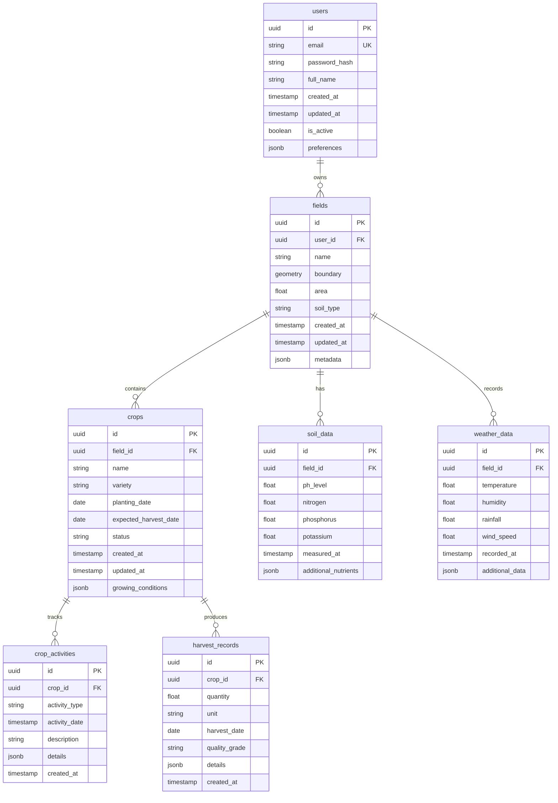

# Database Schema Design

## Overview

### Database Type
- PostgreSQL 15.x
- PostGIS extension for spatial data
- TimescaleDB for time-series data (optional)

### Schema Organization
```
agritech
├── public        # Main application schema
├── audit         # Audit logging schema
└── extensions    # PostgreSQL extensions
```

## Entity Relationship Diagram



## Table Definitions

### Users Table
```sql
CREATE TABLE users (
    id UUID PRIMARY KEY DEFAULT gen_random_uuid(),
    email VARCHAR(255) UNIQUE NOT NULL,
    password_hash VARCHAR(255) NOT NULL,
    full_name VARCHAR(255) NOT NULL,
    created_at TIMESTAMP WITH TIME ZONE DEFAULT CURRENT_TIMESTAMP,
    updated_at TIMESTAMP WITH TIME ZONE DEFAULT CURRENT_TIMESTAMP,
    is_active BOOLEAN DEFAULT true,
    preferences JSONB DEFAULT '{}'::jsonb,
    CONSTRAINT email_valid CHECK (email ~* '^[A-Za-z0-9._%+-]+@[A-Za-z0-9.-]+\.[A-Za-z]{2,}$')
);

CREATE INDEX idx_users_email ON users(email);
```

### Fields Table
```sql
CREATE TABLE fields (
    id UUID PRIMARY KEY DEFAULT gen_random_uuid(),
    user_id UUID NOT NULL REFERENCES users(id),
    name VARCHAR(255) NOT NULL,
    boundary GEOMETRY(POLYGON, 4326) NOT NULL,
    area FLOAT NOT NULL,
    soil_type VARCHAR(50),
    created_at TIMESTAMP WITH TIME ZONE DEFAULT CURRENT_TIMESTAMP,
    updated_at TIMESTAMP WITH TIME ZONE DEFAULT CURRENT_TIMESTAMP,
    metadata JSONB DEFAULT '{}'::jsonb,
    CONSTRAINT area_positive CHECK (area > 0)
);

CREATE INDEX idx_fields_user_id ON fields(user_id);
CREATE INDEX idx_fields_boundary USING GIST(boundary);
```

### Crops Table
```sql
CREATE TABLE crops (
    id UUID PRIMARY KEY DEFAULT gen_random_uuid(),
    field_id UUID NOT NULL REFERENCES fields(id),
    name VARCHAR(255) NOT NULL,
    variety VARCHAR(255),
    planting_date DATE NOT NULL,
    expected_harvest_date DATE NOT NULL,
    status VARCHAR(50) NOT NULL,
    created_at TIMESTAMP WITH TIME ZONE DEFAULT CURRENT_TIMESTAMP,
    updated_at TIMESTAMP WITH TIME ZONE DEFAULT CURRENT_TIMESTAMP,
    growing_conditions JSONB DEFAULT '{}'::jsonb,
    CONSTRAINT valid_dates CHECK (expected_harvest_date > planting_date)
);

CREATE INDEX idx_crops_field_id ON crops(field_id);
CREATE INDEX idx_crops_status ON crops(status);
```

### Crop Activities Table
```sql
CREATE TABLE crop_activities (
    id UUID PRIMARY KEY DEFAULT gen_random_uuid(),
    crop_id UUID NOT NULL REFERENCES crops(id),
    activity_type VARCHAR(50) NOT NULL,
    activity_date TIMESTAMP WITH TIME ZONE NOT NULL,
    description TEXT,
    details JSONB DEFAULT '{}'::jsonb,
    created_at TIMESTAMP WITH TIME ZONE DEFAULT CURRENT_TIMESTAMP
);

CREATE INDEX idx_crop_activities_crop_id ON crop_activities(crop_id);
CREATE INDEX idx_crop_activities_type ON crop_activities(activity_type);
```

### Harvest Records Table
```sql
CREATE TABLE harvest_records (
    id UUID PRIMARY KEY DEFAULT gen_random_uuid(),
    crop_id UUID NOT NULL REFERENCES crops(id),
    quantity FLOAT NOT NULL,
    unit VARCHAR(50) NOT NULL,
    harvest_date DATE NOT NULL,
    quality_grade VARCHAR(50),
    details JSONB DEFAULT '{}'::jsonb,
    created_at TIMESTAMP WITH TIME ZONE DEFAULT CURRENT_TIMESTAMP,
    CONSTRAINT quantity_positive CHECK (quantity > 0)
);

CREATE INDEX idx_harvest_records_crop_id ON harvest_records(crop_id);
CREATE INDEX idx_harvest_records_date ON harvest_records(harvest_date);
```

### Soil Data Table
```sql
CREATE TABLE soil_data (
    id UUID PRIMARY KEY DEFAULT gen_random_uuid(),
    field_id UUID NOT NULL REFERENCES fields(id),
    ph_level FLOAT NOT NULL,
    nitrogen FLOAT NOT NULL,
    phosphorus FLOAT NOT NULL,
    potassium FLOAT NOT NULL,
    measured_at TIMESTAMP WITH TIME ZONE NOT NULL,
    additional_nutrients JSONB DEFAULT '{}'::jsonb,
    CONSTRAINT ph_level_range CHECK (ph_level BETWEEN 0 AND 14)
);

CREATE INDEX idx_soil_data_field_id ON soil_data(field_id);
CREATE INDEX idx_soil_data_measured_at ON soil_data(measured_at);
```

### Weather Data Table
```sql
CREATE TABLE weather_data (
    id UUID PRIMARY KEY DEFAULT gen_random_uuid(),
    field_id UUID NOT NULL REFERENCES fields(id),
    temperature FLOAT NOT NULL,
    humidity FLOAT NOT NULL,
    rainfall FLOAT NOT NULL,
    wind_speed FLOAT NOT NULL,
    recorded_at TIMESTAMP WITH TIME ZONE NOT NULL,
    additional_data JSONB DEFAULT '{}'::jsonb,
    CONSTRAINT humidity_range CHECK (humidity BETWEEN 0 AND 100)
);

CREATE INDEX idx_weather_data_field_id ON weather_data(field_id);
CREATE INDEX idx_weather_data_recorded_at ON weather_data(recorded_at);
```

## Data Types

### Common Data Types
- `UUID`: Unique identifiers
- `VARCHAR`: String data
- `TIMESTAMP WITH TIME ZONE`: Date and time
- `FLOAT`: Numeric values
- `BOOLEAN`: True/false values
- `JSONB`: JSON data
- `GEOMETRY`: Spatial data

### Custom Enums
```sql
CREATE TYPE crop_status AS ENUM (
    'planned',
    'planted',
    'growing',
    'harvesting',
    'completed'
);

CREATE TYPE activity_type AS ENUM (
    'planting',
    'fertilizing',
    'watering',
    'pest_control',
    'harvesting'
);
```

## Indexing Strategy

### Primary Indexes
- Primary keys (UUID)
- Foreign key relationships
- Unique constraints

### Secondary Indexes
- Frequently queried fields
- Search fields
- Date ranges
- Spatial data

### Composite Indexes
```sql
-- Example composite indexes
CREATE INDEX idx_crops_field_status ON crops(field_id, status);
CREATE INDEX idx_weather_field_date ON weather_data(field_id, recorded_at);
```

## Data Migration

### Migration Tools
- Alembic for schema migrations
- SQLAlchemy for ORM
- Custom scripts for data migration

### Version Control
- Migration scripts in version control
- Rollback procedures
- Data validation steps

## Backup Strategy

### Backup Types
- Full database dumps
- Incremental backups
- Point-in-time recovery

### Backup Schedule
- Daily full backups
- Hourly incremental backups
- Transaction log backups

## Performance Considerations

### Optimization Techniques
- Appropriate indexing
- Partitioning large tables
- Regular vacuum and analyze
- Query optimization

### Monitoring
- Query performance
- Index usage
- Table statistics
- Resource utilization
