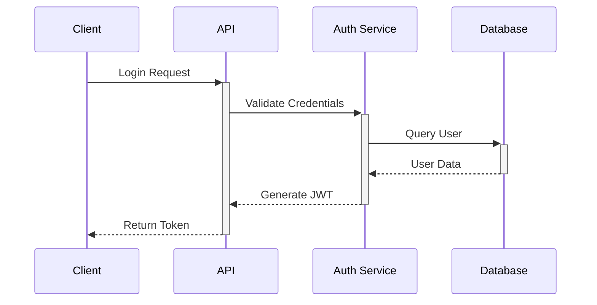
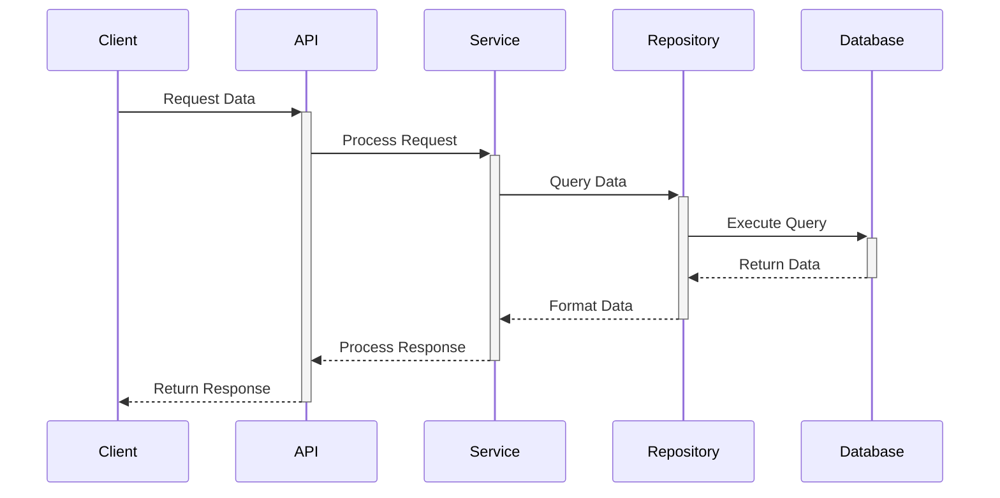

# System Architecture

## Prerequisites

Before reading this document, please familiarize yourself with:
- [Project Overview](../project_planning.md)
- [Development Environment Setup](../setup/development_environment_setup.md)
- [Coding Standards](../guidelines/coding_standards.md)

## Related Documents
- [Database Schema](database_schema.md)
- [Component Design](component_design.md)
- [API Design Guidelines](../guidelines/api_design.md)
- [Security Guidelines](../guidelines/security.md)

## System Overview

### High-Level Architecture
```
┌─────────────────┐     ┌─────────────────┐     ┌─────────────────┐
│   Client Layer  │     │  Service Layer  │     │     Storage     │
│  (React + TS)   │────▶│   (FastAPI)    │────▶│   PostgreSQL    │
└─────────────────┘     └─────────────────┘     └─────────────────┘
```

### Key Components
1. Frontend (Client Layer)
   - React.js + TypeScript
   - Chakra UI
   - Zustand (State Management)
   - React Query (Data Fetching)

   For frontend setup and guidelines, see:
   - [Development Environment Setup: Frontend](../setup/development_environment_setup.md#frontend-setup)
   - [Coding Standards: TypeScript](../guidelines/coding_standards.md#typescript-frontend)

2. Backend (Service Layer)
   - FastAPI Framework
   - SQLAlchemy ORM
   - Pydantic Models
   - JWT Authentication

   For backend setup and guidelines, see:
   - [Development Environment Setup: Backend](../setup/development_environment_setup.md#backend-setup)
   - [Coding Standards: Python](../guidelines/coding_standards.md#python-backend)
   - [Database Schema](database_schema.md)

3. Database (Storage Layer)
   - PostgreSQL
   - PostGIS Extensions
   - Connection Pooling

   For database setup and guidelines, see:
   - [Database Schema](database_schema.md)
   - [Security Guidelines](../guidelines/security.md)

## Detailed Architecture

### Frontend Architecture
```
┌─────────────────────────────────────────┐
│              Application                │
├─────────────────┬─────────────────┬────┤
│     Pages       │   Components    │    │
│                 │                 │    │
│ - Dashboard     │ - Field Map     │ S  │
│ - Field Manager │ - Crop Calendar │ t  │
│ - Crop Planner  │ - Weather Info  │ a  │
│ - Reports       │ - Data Tables   │ t  │
│ - Settings      │ - Charts        │ e  │
├─────────────────┼─────────────────┤    │
│    Services     │     Hooks       │    │
│                 │                 │    │
│ - API Client    │ - useFields     │    │
│ - Auth Service  │ - useCrops      │    │
│ - Map Service   │ - useWeather    │    │
└─────────────────┴─────────────────┴────┘
```

See [Component Design](component_design.md) for detailed component interactions.

### Backend Architecture
```
┌─────────────────────────────────────────┐
│              FastAPI App                │
├─────────────────┬─────────────────┬────┤
│     Routes      │     Services    │    │
│                 │                 │    │
│ - Field API     │ - Field Service │ M  │
│ - Crop API      │ - Crop Service  │ i  │
│ - User API      │ - User Service  │ d  │
│ - Weather API   │ - Auth Service  │ d  │
│ - Report API    │ - Map Service   │ l  │
├─────────────────┼─────────────────┤ e  │
│     Models      │  Repositories   │ w  │
│                 │                 │ a  │
│ - Field Model   │ - Field Repo    │ r  │
│ - Crop Model    │ - Crop Repo     │ e  │
│ - User Model    │ - User Repo     │    │
└─────────────────┴─────────────────┴────┘
```

## Component Interactions

### Authentication Flow


For implementation details, see:
- [Security Guidelines](../guidelines/security.md)
- [API Design: Authentication](../guidelines/api_design.md#authentication)

### Data Flow


For more details, see:
- [API Design: Endpoints](../guidelines/api_design.md#endpoints)
- [Database Schema: Fields](database_schema.md#fields-table)

## Technical Stack Details

### Frontend Technologies
- **Framework**: React 18.x
- **Language**: TypeScript 5.x
- **UI Framework**: Chakra UI
- **State Management**: Zustand
- **Data Fetching**: React Query
- **Maps**: Leaflet
- **Charts**: Recharts
- **Forms**: React Hook Form
- **Testing**: Jest + React Testing Library
- **Build Tool**: Vite

### Backend Technologies
- **Framework**: FastAPI 0.100.x
- **ORM**: SQLAlchemy 2.x
- **Validation**: Pydantic 2.x
- **Authentication**: JWT
- **Task Queue**: Celery
- **Cache**: Redis
- **Testing**: Pytest
- **Documentation**: OpenAPI/Swagger

### Infrastructure
- **Database**: PostgreSQL 15.x
- **Cache**: Redis 7.x
- **File Storage**: Cloudinary
- **Hosting**: Render/Railway
- **CI/CD**: GitHub Actions
- **Monitoring**: Sentry

## Security Architecture

### Authentication
- JWT-based authentication
- Refresh token rotation
- Role-based access control
- Session management

### Data Security
- Data encryption at rest
- TLS for data in transit
- Input validation
- Output sanitization

### API Security
- Rate limiting
- CORS configuration
- Request validation
- Error handling

## Scalability Considerations

### Horizontal Scaling
- Stateless application design
- Load balancing
- Database replication
- Caching strategy

### Performance Optimization
- Database indexing
- Query optimization
- Asset optimization
- Caching layers

## Monitoring and Logging

### Application Monitoring
- Performance metrics
- Error tracking
- User analytics
- Resource usage

### Logging Strategy
- Structured logging
- Log aggregation
- Error reporting
- Audit trails

## Deployment Architecture

### Development
```
└── Local Environment
    ├── Development Server
    ├── Local Database
    └── Mock Services
```

### Staging
```
└── Staging Environment
    ├── Staging API
    ├── Staging Database
    └── Test Services
```

### Production
```
└── Production Environment
    ├── Load Balancer
    ├── Multiple API Instances
    ├── Primary Database
    ├── Read Replicas
    └── Production Services
```

## Future Considerations

### Planned Improvements
- Microservices architecture
- GraphQL API
- Real-time updates
- Mobile application
- Machine learning integration

### Scalability Plans
- Global CDN
- Multi-region deployment
- Database sharding
- Service mesh implementation
