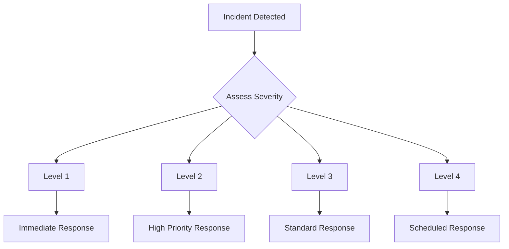

# Incident Response Protocol

## Incident Classification

### Severity Levels

#### Level 1 (Critical)
- System-wide outage
- Data breach
- Security compromise
- Production database failure

#### Level 2 (High)
- Partial system outage
- Performance degradation
- API errors
- Authentication issues

#### Level 3 (Medium)
- Non-critical feature failure
- Minor performance issues
- Isolated errors
- UI/UX problems

#### Level 4 (Low)
- Cosmetic issues
- Minor bugs
- Documentation errors
- Feature requests

## Response Procedures

### Initial Response


### Response Steps
1. Incident Detection
2. Initial Assessment
3. Team Notification
4. Impact Analysis
5. Response Action
6. Resolution
7. Post-Mortem

## Team Responsibilities

### Incident Commander
- Coordinate response
- Make critical decisions
- Communicate with stakeholders
- Track progress

### Technical Lead
- Technical assessment
- Direct technical response
- Resource allocation
- Solution validation

### Communications Lead
- Stakeholder updates
- User communications
- Status page updates
- Documentation

## Communication Templates

### Incident Notification
```
INCIDENT NOTIFICATION
Status: [ACTIVE/RESOLVED]
Severity: [LEVEL]
Time Detected: [TIMESTAMP]
Impact: [DESCRIPTION]
Current Status: [DETAILS]
Next Update: [TIME]
```

### Status Updates
```
STATUS UPDATE #[NUMBER]
Time: [TIMESTAMP]
Current Status: [DETAILS]
Actions Taken: [LIST]
Next Steps: [PLAN]
Expected Resolution: [TIME]
```

### Resolution Notice
```
INCIDENT RESOLVED
Time Resolved: [TIMESTAMP]
Duration: [TIME PERIOD]
Root Cause: [DESCRIPTION]
Resolution: [DETAILS]
Prevention Measures: [PLAN]
```

## Response Procedures

### Security Incident
```python
class SecurityIncidentHandler:
    async def handle_security_incident(self, incident: SecurityIncident):
        """Handle security-related incidents."""
        # 1. Immediate Response
        await self.isolate_affected_systems(incident.affected_systems)
        await self.notify_security_team(incident)

        # 2. Assessment
        impact = await self.assess_security_impact(incident)
        if impact.severity >= SecuritySeverity.HIGH:
            await self.initiate_emergency_response(incident)

        # 3. Containment
        await self.contain_security_breach(incident)
        await self.collect_forensic_data(incident)

        # 4. Recovery
        await self.restore_affected_systems(incident)
        await self.verify_system_integrity()

        # 5. Documentation
        await self.document_incident(incident)
```

### System Outage
```python
class OutageHandler:
    async def handle_system_outage(self, outage: SystemOutage):
        """Handle system outage incidents."""
        # 1. Detection
        await self.verify_outage_extent(outage)
        await self.notify_operations_team(outage)

        # 2. Diagnosis
        root_cause = await self.diagnose_outage(outage)
        await self.update_status_page(outage, root_cause)

        # 3. Recovery
        await self.implement_recovery_plan(root_cause)
        await self.verify_system_recovery()

        # 4. Validation
        await self.run_system_health_checks()
        await self.verify_data_integrity()

        # 5. Documentation
        await self.document_outage_incident(outage, root_cause)
```

## Incident Documentation

### Incident Report Template
```markdown
# Incident Report

## Overview
- Incident ID: [ID]
- Date: [DATE]
- Duration: [DURATION]
- Severity: [LEVEL]

## Timeline
- [TIME]: Initial detection
- [TIME]: Response initiated
- [TIME]: Root cause identified
- [TIME]: Resolution implemented
- [TIME]: Service restored

## Impact
- Affected Systems: [LIST]
- User Impact: [DESCRIPTION]
- Business Impact: [DESCRIPTION]

## Root Cause
[DETAILED DESCRIPTION]

## Resolution
[DETAILED DESCRIPTION]

## Prevention Measures
[LIST OF ACTIONS]

## Lessons Learned
[KEY TAKEAWAYS]
```

## Recovery Procedures

### System Recovery
```bash
#!/bin/bash
# system_recovery.sh

# 1. Assessment
./check_system_status.sh

# 2. Backup Verification
./verify_backup_integrity.sh

# 3. Service Recovery
systemctl restart agritech-api
systemctl restart agritech-worker

# 4. Verification
./verify_system_health.sh
```

### Data Recovery
```python
async def recover_data(incident_info: IncidentInfo):
    """Recover data after an incident."""
    try:
        # 1. Verify backup
        backup = await verify_latest_backup()
        
        # 2. Restore data
        await restore_from_backup(backup)
        
        # 3. Verify integrity
        await verify_data_integrity()
        
        # 4. Resume operations
        await resume_services()
        
    except Exception as e:
        await escalate_incident(e)
```

## Prevention Measures

### Monitoring Improvements
```python
class EnhancedMonitoring:
    def configure_alerts(self):
        """Configure enhanced monitoring alerts."""
        return {
            'cpu_usage': {
                'threshold': 80,
                'duration': '5m',
                'action': 'notify_team'
            },
            'error_rate': {
                'threshold': 1,
                'duration': '1m',
                'action': 'page_oncall'
            },
            'api_latency': {
                'threshold': 500,
                'duration': '5m',
                'action': 'auto_scale'
            }
        }
```

### System Hardening
```python
class SystemHardening:
    async def implement_security_measures(self):
        """Implement system hardening measures."""
        measures = [
            await self.update_firewall_rules(),
            await self.enable_audit_logging(),
            await self.configure_rate_limiting(),
            await self.enforce_authentication(),
            await self.encrypt_sensitive_data()
        ]
        return await self.verify_security_measures(measures)
```

## Training and Preparation

### Training Schedule
1. Monthly incident response drills
2. Quarterly security training
3. Annual disaster recovery test
4. Continuous documentation updates

### Documentation Requirements
- Response procedures
- Contact information
- System diagrams
- Recovery scripts
- Post-mortem templates

## Post-Incident Analysis

### Analysis Template
```markdown
# Post-Incident Analysis

## Incident Summary
- What happened?
- Why did it happen?
- How was it detected?
- How was it resolved?

## Timeline Analysis
- Detection time
- Response time
- Resolution time
- Recovery time

## Impact Analysis
- System impact
- User impact
- Business impact
- Reputation impact

## Root Cause Analysis
- Primary cause
- Contributing factors
- Missed signals
- Prevention opportunities

## Recommendations
- Immediate actions
- Short-term improvements
- Long-term changes
- Process updates

## Action Items
- [ ] Update monitoring
- [ ] Improve documentation
- [ ] Enhance testing
- [ ] Update procedures
```
